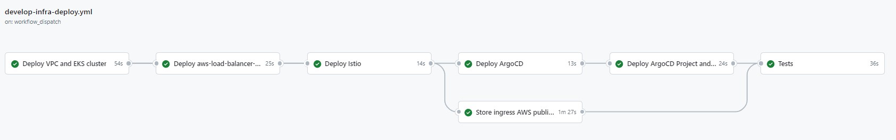
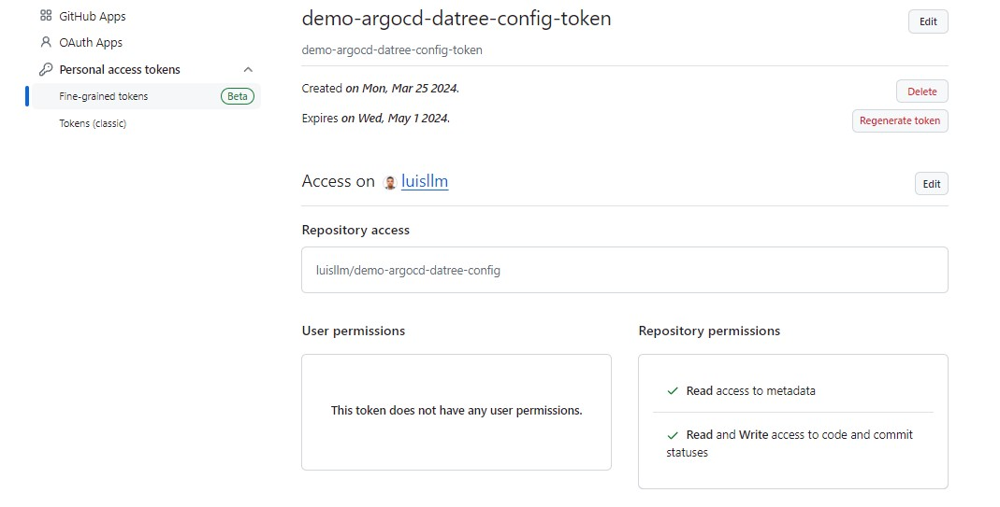

# Description

Demo that does the following:
- Deploys a VPC with an EKS cluster
- Deploys aws-load-balancer-controller
- Deploys Istio and 2 Istio Ingress Gateways, one to access ArgoCD UI, another one to access the app/s
- Deploys ArgoCD in the EKS cluster and configures a gateway and vs to expose the ArgoCD UI via the AWS public LB and Istio IG
- Deploys the ArgoCD project and apps, one of which is exposed via the other AWS public NLB and the other public Istio IG
- Runs some basic tests to verify the PODs are running and it also sends a test request to the public LB
  

# Prerequisites

- S3 bucket in the Account and Region where you are deploying: <environment>-test-llm-terraform-state
  
- Terraform infra.tfvars per environment: https://github.com/luisllm/environments.git

- Helm charts and custom values files: https://github.com/luisllm/demo-argocd-datree-config.git
This is the config repo that ArgoCD will watch to deploy and update the apps

- Github Personal Access token to be able to push changes to the previous repo where the helm charts and values files are located

# Pricing per environment

1 x EKS cluster
$0.10 per hour * 24h = $2.4 per day

3 x t3.small SPOT
$0.0082 per hour * 24h =  $0.0082 per day 
$0.0082 per day * 3 ec2s = $0.5904 per day

1 x NATGW
$0.045 per hour * 24h = $1.08 per day

2 x NLB 
$0.0225 per hour * 24h = $0.54 per day
$0.54 per day * 2 NLBs = $1.08 per day

TOTAL PER DAY: $2.4 + $0.5904 + $1.08 + $1.08 = $5.1504

# References

ArgoCD:
- https://www.youtube.com/watch?v=AvLuplh1skA&list=PLTiQErIEf8SZsSwdDqITSPJvMDBGVJX-d&index=1
- https://www.youtube.com/watch?v=17894DTru2Y&list=PLTiQErIEf8SZsSwdDqITSPJvMDBGVJX-d&index=2

Apps deployed with ArgoCD:
- https://github.com/LukeMwila/microservice-products
- https://github.com/LukeMwila/microservice-orders
- https://github.com/LukeMwila/microservice-graphql-server
- https://github.com/LukeMwila/microservice-example-helm-charts

Datree:
- https://github.com/datreeio/helm-datree
- https://medium.com/@KushanJanith/prevent-kubernetes-misconfigurations-with-datree-ca1caa8b0e4

